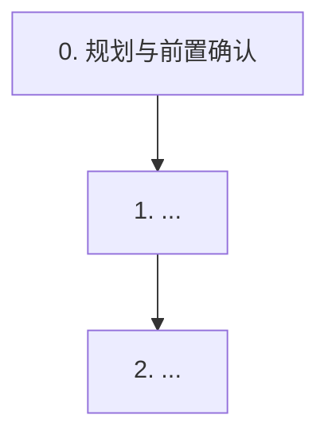

# 任务清单: [功能名称]

目录: `helloagents/plan/YYYYMMDDHHMM_<feature>/`

> 建议结构（强烈推荐）：`##` 表示阶段/模块，`### x.y` 表示“可独立验收”的子任务；每个 `###` 下只放 1 条 checkbox。
> 这样 `helloagents-plan-to-issues-csv` 默认即可按 `###` 拆分为细粒度 issues，降低“台账不够细”带来的执行偏差与幻觉风险。
>
> 反幻觉硬约束（强制）：
> 1) 任意“事实性信息”（接口/字段/表结构/枚举/配置/权限/路径/类名方法）必须有真相源证据；否则标记为 `[?]` 并加入确认任务
> 2) 禁止在**可执行任务**中保留占位符目标（如 `path/to/file.ts`、`**/*.java`、`...`、`xxx`）；未定位时先写“定位任务”
> 3) 并行仅限“只读信息收集”（检索 + 并行精读片段）；并行写入仅允许“主代理定稿后分发写入包 → 子代理只写不想”且无写冲突；否则写入一律串行，避免上下文错配与写冲突
> 4) 测试/构建/回归必须只能由主代理串行执行；子代理禁止跑测试与回归（避免环境争用与结果不可追溯）

---

## DAG（依赖关系图）

> 要求：
> - DAG 用来表达“依赖”，不是时间顺序；执行时以 DAG 依赖为准，而不是按章节编号机械顺序。
> - 每个 `### x.y` 子任务在标题中标注依赖（例如 `（依赖 1.2）`），依赖满足后即可提前执行。

## 快速落地路径（推荐执行顺序，不必机械按章节顺序）

> 目标：用最短可运行链路（vertical slice）尽快交付核心闭环，其余能力按支线逐步补齐/并行补齐。

- Step 1（先打通最小闭环）：做 `x.y` + `a.b`，得到“可跑通/可验收”的最小链路
- Step 2（补齐关键门禁/异常分支）：做 `...`，让链路可提测
- Step 3（收尾回归与文档）：做 `...`，沉淀证据与回滚策略

## 0. 规划与前置确认
- Phase 1: <目标 + 产物 + 验证方式>（联网：<否|可选|已用：竞品/开源/文档>）
- Phase 2: <目标 + 产物 + 验证方式>（联网：<否|可选|已用：竞品/开源/文档>）
- Phase 3: <目标 + 产物 + 验证方式>（联网：<否|可选|已用：竞品/开源/文档>）

### 0.0 依赖关系图与并行/串行划分（必做）
- [ ] 在本 `task.md` 的 `## DAG（依赖关系图）` 与 `## 快速落地路径（推荐执行顺序，不必机械按章节顺序）` 两节中，给出：依赖关系图 + 推荐执行顺序 + 并行批次说明：区分可并行节点（只读信息收集；受控并行写入=主代理定稿后分发写入包） vs 必须串行节点（汇总/决策/补丁合并/验证、脚本/写冲突/顺序依赖/门禁/数据迁移）
- [ ] 为每个 Phase/模块给出粗粒度估时与资源占用（人日/小时、环境/权限/服务依赖、测试预计耗时）
- [ ] 若计划启用子代理/受控并行写入：先确认 Codex `multi_agent` 已启用（例如：`[features].multi_agent = true` 或 `/experimental`）；若不可用则删除并行写入相关项，写入一律串行
- [ ] multi_agent 场景下：每个子代理线程首次使用 `code-index` 前都需要先 `set_project_path(<项目根目录>)` 绑定本线程的 stdio MCP 进程；重操作（`refresh_index/build_deep_index`）默认仅主代理执行，子代理只做只读查询并输出证据锚点（必要时由主代理统一检索并分发命中结果）
- [ ] 若计划启用受控并行写入：主代理先输出“写入包清单”（每包=目标文件/区域+补丁内容+最小验收），并明确哪些包可并行、哪些必须串行
- [ ] 若启用受控并行写入：子代理写入完成后由主代理逐包验收（查看 diff + 回读关键片段 + 最小相关测试），验收不通过不得进入下一任务

### 0.1 口径锚点与证据补齐（必做）
- [ ] 在 `why.md#真相源与口径锚点` 与 `how.md#口径与证据` 补齐关键口径的真相源证据；未确认项标记为 `[?]` 并列为追问问题/待办任务

### 0.2 梳理阻塞与依赖
- [ ] 梳理阻塞与依赖并写入 `how.md#依赖与阻塞`

### 0.3（可选）补充外部参考
- [ ] 补充外部参考并写入 `how.md#外部参考`（关键词/抓取时间/URL/结论）

### 0.4（可选）补充 UI/UX 要点（离线精致化）
- [ ] 补充 UI/UX 要点并写入 `why.md#用户体验（UX，可选）` / `why.md#视觉与动效（UI，可选）`（离线精致化：见技能参考 `references/ui_ux.md`，支持 `UI=on/off`）

### 0.5（条件必做）前端影响面确认（frontendImpact=possible|yes 时保留；none 时删除）
- [ ] 确认前端影响面并写入 `why.md#用户体验（UX，可选）`（受影响端/页面/入口、字段展示、交互按钮、权限可见性、异常/空态/加载态）

### 0.6（条件必做）前端展示口径确认（frontendImpact=possible|yes 时保留；none 时删除）
- [ ] 确认展示口径并写入 `why.md#用户体验（UX，可选）`（字段含义/单位/舍入、状态文案、错误提示、与后端字段/枚举对齐）

### 0.7（条件必做）前端心智负担评审与交互简化（frontendImpact=possible|yes 时保留；none 时删除）
- [ ] 评审并降低心智负担并写入 `why.md#用户体验（UX，可选）`（步骤数/决策点/默认值/渐进披露/字段分组/防错反馈）；若复杂度主要来自后端契约（多接口拼装/字段不足/状态枚举混乱/错误码不友好），优先在后端消解，避免把复杂性转嫁到前端

## 1. [核心功能模块名称]

### 1.1 [一句话子任务标题]
- [ ] 在 `path/to/file.ts` 中实现 [具体功能]，验证 why.md#[需求标题anchor]-[场景标题anchor]

### 1.2 [一句话子任务标题]（依赖 1.1）
- [ ] 在 `path/to/file.ts` 中实现 [具体功能]，验证 why.md#[需求标题anchor]-[场景标题anchor]，依赖任务 1.1

## 2. [次要功能模块名称]

### 2.1 [一句话子任务标题]（依赖 1.2）
- [ ] 在 `path/to/file.ts` 中实现 [具体功能]，验证 why.md#[需求标题anchor]-[场景标题anchor]，依赖任务 1.2

## 3. 安全检查

### 3.1 安全检查（输入验证/敏感信息/权限/EHRB）
- [ ] 执行安全检查（输入验证、敏感信息处理、权限控制、EHRB 风险规避）

## 4. 文档更新

### 4.1 更新知识库文件
- [ ] 更新 <知识库文件>

## 5. 测试

### 5.1 场景测试： [场景1名称]
- [ ] 在 `tests/integration/xxx.test.ts` 中实现场景测试: [场景1名称]，验证点: [关键验证点列表]

## 6. 验收与验证

### 6.1 补全验收与验证文档
- [ ] 补全 `why.md#验收与验证`（功能验收/非功能验收/最小验证步骤）

### 6.2 执行最小验证并记录证据
- [ ] 执行最小验证步骤并记录结果（命令输出/截图/关键日志）

## 7. 回滚与发布

### 7.1 回滚/降级策略（写入 how.md）
- [ ] 补全 `how.md#测试与部署` 的 回滚/降级 策略（回滚条件、步骤、数据兼容性、开关/灰度）

### 7.2（可选）回滚演练 checklist
- [ ] 准备回滚演练 checklist（如涉及生产/高风险变更）

---

## 任务状态符号
- `[ ]` 待执行
- `[√]` 已完成
- `[X]` 执行失败
- `[-]` 已跳过
- `[?]` 待确认

